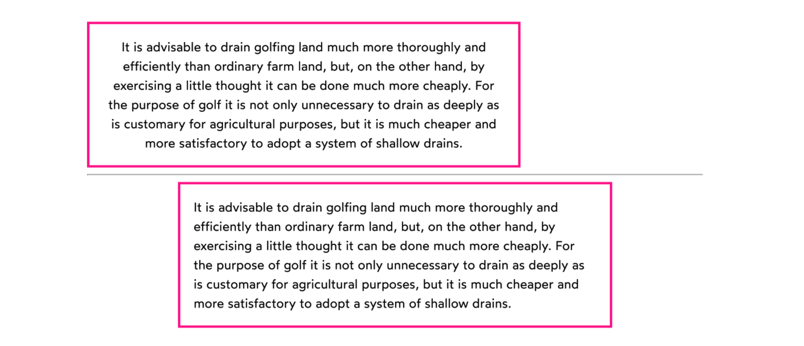

# text rendering

## kerning

Kerning is the spacing between individual characters - and different browsers implement different kerning algorithms

You can disable kerning altogether with

```scss
.selector {
  font-kerning: none;
}
```

`letter-spacing` is multiplies whatever kerning the browser already implements.

## text rasterization

rasterization is the process where vectors are turned into pixels, which produces very sharp, boxy letters. to fix this, the os will apply an anti-aliasing algorithm to smooth things out. this means that the same browser will have slightly different typography across different operating systems!

**tldr** there's not good way to mess with the anti-aliasing algorithms.

### text overflow

How does the browser decide where to line-break? Certain characters called "soft wrap opportunities" determine where words start and end, and whenever a word breaks past 80 characters (or whatever the limit), it finds the nearest soft wrap opportunity.

- every white space character and `-` is a soft wrap opportunity

### wrapping

What do you do when there's no soft wrap opportunity and the word is still too long? aside from the options we used for containers (`overflow: auto`, `overflow: hidden`), typography also has other options.

```scss
.selector {
  overflow-wrap: break-word;
}
```

will break the word itself by character! to add a hyphen, add the

```scss
.selector {
  overflow-wrap: break-word;
  hyphens: auto;
}
```

> you need both!

the hyphens won't be selectable, so you can copy and paste urls like normal.

### ellipsis

For when you want to replace line-breaking with an ellipsis instead. So instead of a long word being broken up by letter (with or without hyphens), it will just have an ellipsis.

```scss
.selector {
  overflow: hidden;
  text-overflow: ellipsis;
}
```

little weird that we need both, but :shrug:

### single-line ellipsis

what if we want to avoid line wrapping altogether and only use ellipsis? You can do what we did above, but add `white-space: nowrap;` to prevent linewrapping.

### multi-line ellipsis

what if we want to show a few lines, then add the ellipsis after?

```scss
.selector {
  display: -webkit-box;
  -webkit-box-orient: vertical;
  -webkit-line-clamp: 3;
  // hides clamped off lines
  overflow: hidden;
}
```

if the element above is also used a flexbox child, this can cause some bugs! You can solve this with just a wrapper div.

# print-style layouts

what if we want to have a layout that looks like print media?

## column layout

```scss
.wrapper {
  columns: 2;
  column-gap: 16px;
}

.particular_paragraph {
  // if you want to avoid it breaking across columns
  break-inside: avoid;
}
```

## floats

although floats have mostly been replaced with flexbox and grid, there's a few things floats can do that nothing else can

> "A floated element is like a boulder in a stream; the other content flows smoothly around it. In this case, text wraps seamlessly around an image, but we can use this trick for any embedded element, not just images!"

## indentation

one option is to target the first letter

```scss
p::first-letter {
  margin-left: 2rem;
}
```

or you can use the fancy property

```scss
p {
  text-indent: 2rem;
}
```

## justified alignment

with `text-align: justify;` the text will have spacing so that any amount of text will fill the whole line from edge to edge.

```scss
p {
  text-align: justify;
}
```

# masonry grid

```scss
ul {
  column-count: 3;
  // vertical gap between columns
  column-gap: 16px;
}

img {
  // images are inline by default, so they get weird letter spacing ...
  display: block;
  margin-bottom: 16px;
}
```

masonry layout is from top to bottom, so top left to bottom left, then to top middle, bottom middle, top right, bottom right. this can be an issue with tabbing through really long pages.

# text styling

## line length

long lines can be difficult to read, so setting a max width is a nice feature

```scss
.selector {
  max-width: 50ch;
}
```

`1ch` is equal to the width of `0` at the current font size.

## text alignment

`text-align` will move all the individual characters to the middle of each line, while `align-items` will move the whole paragraph block to the middle of the container. Big difference!



# web fonts

when downloading a font, try to wrap it in `''`, it helps differentiate it from stack fonts.

you have a few options when it comes to using web fonts. First, you can use something like [google fonts](https://fonts.google.com/), which gives you a link to embed in your html file. However this can come with some loading costs since it has to make a blocking network call to fetch the css.

you can also host a web font yourself (i.e. on your own server) with something like [fontsource](https://fontsource.org/). you can `npm install` the font you want!

the manual way

- convert the font format. fonts are normally `.otf` or `.ttf` whcih the web can't read. convert it with something like this [webfont generator](https://www.fontsquirrel.com/tools/webfont-generator)
- declare the web font with the `@font-face` tag, one for teach weight and style

```scss
@font-face {
  font-family: "Wotfard";
  src: url("/fonts/wotfard-regular.woff2") format("woff2");
  font-weight: 400;
  font-style: normal;
}
@font-face {
  font-family: "Wotfard";
  src: url("/fonts/wotfard-medium.woff2") format("woff2");
  font-weight: 500;
  font-style: normal;
}
@font-face {
  font-family: "Wotfard";
  src: url("/fonts/wotfard-bold.woff2") format("woff2");
  font-weight: 700;
  font-style: normal;
}
@font-face {
  font-family: "Wotfard";
  src: url("/fonts/wotfard-regular-italic.woff2") format("woff2");
  font-weight: 400;
  font-style: italic;
}
```

## font loading ux

while the web font loads, you have two options:

1. wait until the web font has been downloaded before showing any text (FOIT)
1. render a fallback font, one that's locally installed on the user's device (FOUT)

more precisely, there are three windows to be aware of

1. **the block period**: the text is painted in invisibale ink
1. **the swap period**: a fallback font is rendered, the first available in the font stack
1. **the failure period**: if the desired font isn't loaded during the previous two periods, it'll show the fallback font forever

`font-display` is a way to control the length of each window

- `font-display: block` has a moderate block period, about 3 seconds, and an infinite swap period
  - good for fonts that are vital, like icon fonts where the swap would look awful
- `font-display: swap` has a very short block period, about 100ms, and an infinite swap period
- `font-display: fallback` has a very short block period with a moderate swap period
  - recommended by josh, good middle ground
- `font-dispaly: optional` has a very short block with no swap and an infinite failure
  - good for fonts that are only a subtle improvements

Some browsers support css properties are called `f-mods`, which can be used to make the swap less jarring

## font optimization
